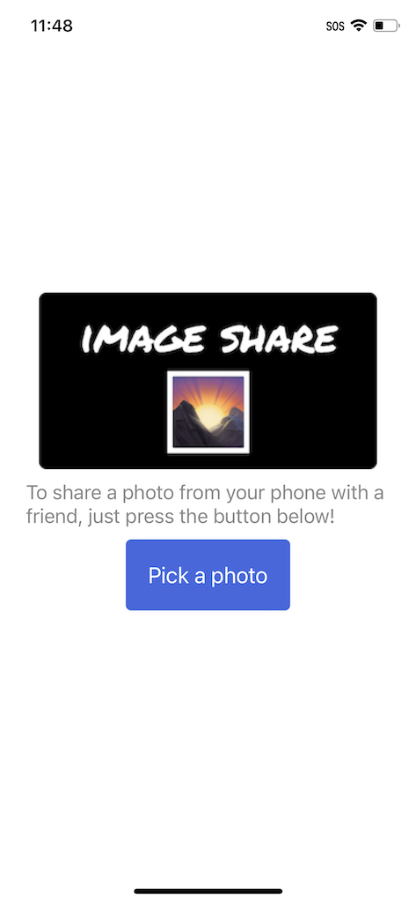
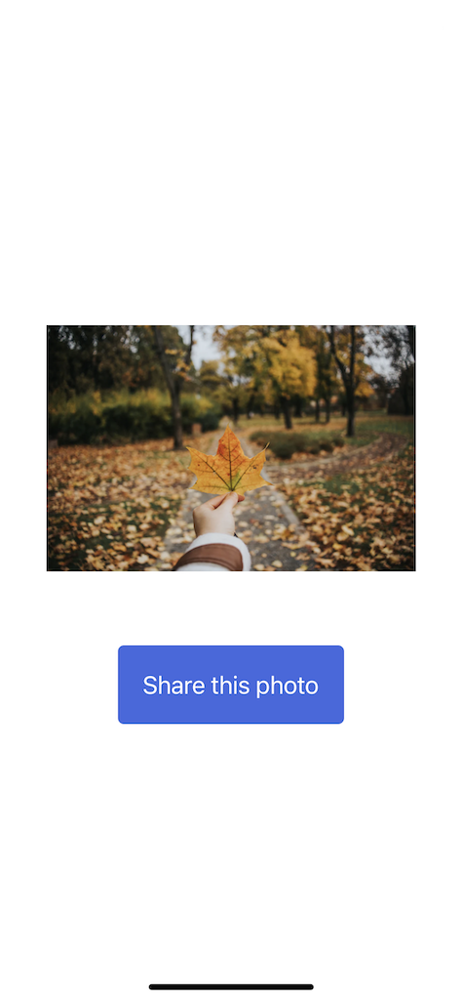

# Image Share React Native App

This is a cross-platform mobile application build with React Native and Expo.
If you found the app useful, give the repo a star 🌟 it's free!

## Description

The app will allow you to open your mobile phone's photo gallery and select a photo to share with a friend.

## Requirements

To run this application you'll need:
 1. [NodeJS](https://nodejs.org/en/) installed in your computer.
 2. A text editor recommended [VS Code](https://code.visualstudio.com/download)
 2. Expo Go app (if you want to run the app on your phone) [Android Play Store](https://play.google.com/store/apps/details?id=host.exp.exponent) and [iOS App Store](https://apps.apple.com/app/expo-go/id982107779)  or an [emulator](https://www.bluestacks.com/android-emulator.html) for your computer.
 3. [Git](https://git-scm.com/) (you problably have it already)
 4. Last but not least Expo CLI run: `npm install -g expo-cli`

## How to run this application

  1. Clone the application using the terminal or [Github Desktop](https://docs.github.com/en/desktop/contributing-and-collaborating-using-github-desktop/adding-and-cloning-repositories/cloning-and-forking-repositories-from-github-desktop).
  2. Inside of the main directory -> ImageShare run: `npm install`
  3. Run: `expo start` (this will start the development server)
  4. Scan the QR Code with your phone camera to run the app on Expo Go
  5. Enjoy the app! 👨🏻‍💻

  ## Resources 

  You can find the instructions on how this app was build on the official [Expo docs](https://docs.expo.dev/tutorial/planning/).
  